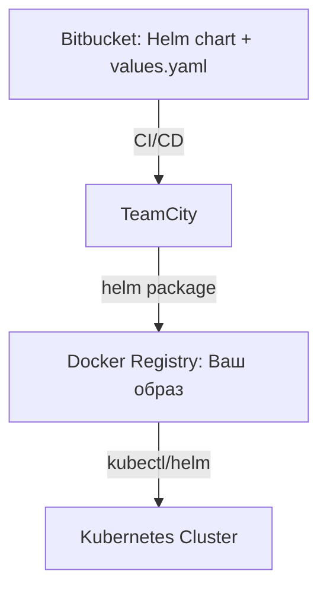
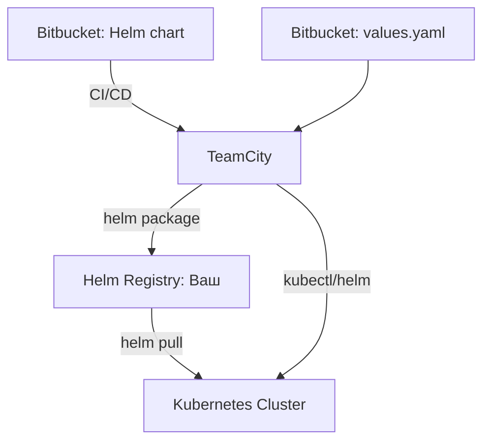
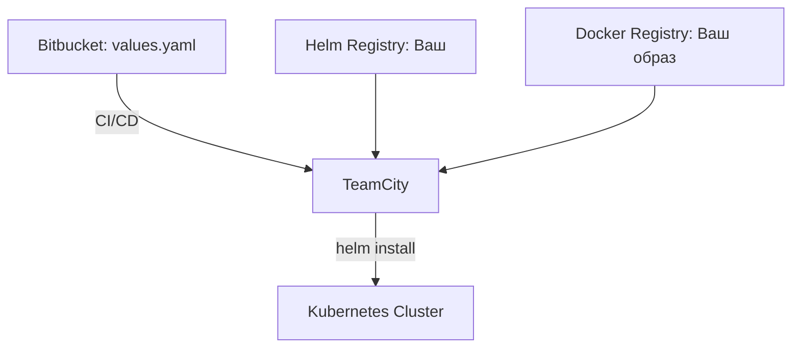
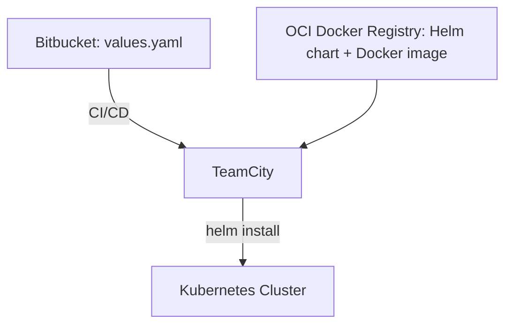
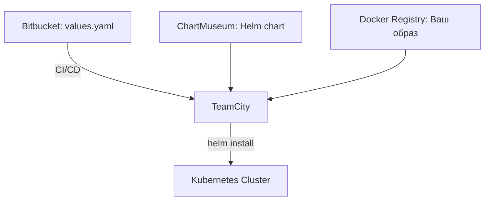
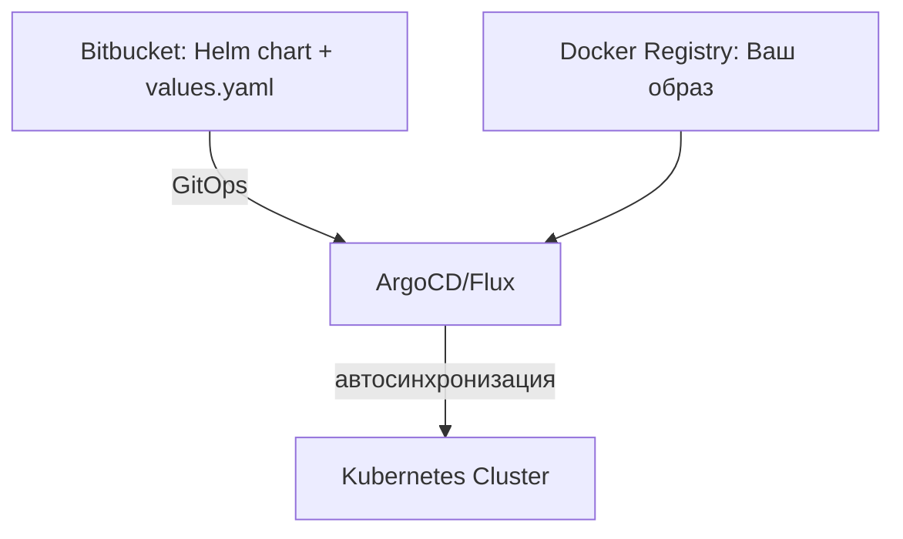

# Сценарии деплоя Flex в Kubernetes

## Входные данные
- **Kubernetes** (kubectl, helm)
- **Docker-репозиторий (ваш)** — доступен
- **Docker-репозиторий производителя** — недоступен
- **Bitbucket** — для хранения Helm-чартов/values
- **TeamCity** — CI/CD

---

## Вариант 1: Всё в Bitbucket (монорепозиторий)

- **Плюсы:** Всё в одном месте, просто управлять версиями.
- **Минусы:** Нет разделения секретов, возможен рост репозитория.

---

## Вариант 2: Helm-чарты в Bitbucket, values.yaml — отдельно

- **Плюсы:** Можно переиспользовать чарты, values — отдельно для разных окружений.
- **Минусы:** Требуется синхронизация версий.

---

## Вариант 3: Helm-чарты в вашем Helm Registry, values — в Bitbucket

- **Плюсы:** Чарты централизованы, values — в GitOps стиле.
- **Минусы:** Требуется поддержка Helm Registry.

---

## Вариант 4: Всё в вашем реестре (Docker + Helm), только values в Bitbucket

- **Плюсы:** Максимальная автономность, быстрый деплой.
- **Минусы:** Требуется поддержка Helm Registry, values — единственная точка кастомизации.

---

## Вариант 5: OCI-совместимый Docker Registry для Helm-чартов

- **Плюсы:** Централизация хранения, простота автоматизации.
- **Минусы:** Требуется поддержка OCI для Helm-чартов.

---

## Вариант 6: Внешний Helm Registry (ChartMuseum)

- **Плюсы:** Гибкость версионирования чартов, простота интеграции с CI/CD.
- **Минусы:** Необходимость поддержки дополнительного сервиса.

---

## Вариант 7: Полный GitOps (ArgoCD/Flux)

- **Плюсы:** Автоматизация, прозрачность, история изменений, откаты.
- **Минусы:** Требуется внедрение GitOps-контроллера, интеграция с приватными реестрами.

---

# Исследование: Как выбрать оптимальный вариант?

## Критерии выбора
- **Безопасность:** Где хранятся секреты? Как управлять доступом?
- **Автоматизация:** Насколько легко интегрировать с TeamCity/CI/CD?
- **Гибкость:** Можно ли быстро менять values/charts для разных окружений?
- **Масштабируемость:** Как вариант ведёт себя при росте числа сервисов/окружений?
- **Простота поддержки:** Сколько ручных действий требуется для обновления?

## Сценарии и рекомендации

### Малый проект, мало окружений, минимум DevOps-ресурсов
- **Вариант:** Всё в Bitbucket (чарты + values)
- **Почему:** Минимум инфраструктуры, просто поддерживать, легко onboard новых участников.

### Средний проект, несколько окружений, требуется разделение доступа
- **Вариант:** Чарты и values в Bitbucket, образы — в своём Docker Registry
- **Почему:** Гибко управлять версиями, легко автоматизировать через TeamCity, удобно для GitOps.

### Большой проект, много команд, требуется масштабируемость и безопасность
- **Вариант:** Чарты в Helm Registry (Harbor/ChartMuseum/OCI), values — в Bitbucket, образы — в Docker Registry
- **Почему:** Централизованное хранение, разграничение доступа, поддержка разных окружений, легко интегрировать с GitOps.

### Требуется максимальная автоматизация и прозрачность (GitOps)
- **Вариант:** Всё, кроме образов, в Bitbucket, деплой через ArgoCD/Flux
- **Почему:** Автоматизация, история изменений, откаты, соответствие best practices DevOps.

## Итоговая таблица сравнения

| Вариант                                   | Безопасность | Автоматизация | Гибкость | Масштабируемость | Простота поддержки |
|--------------------------------------------|--------------|---------------|----------|------------------|--------------------|
| Всё в Bitbucket                           | +            | +             | +/-      | -                | ++                 |
| Чарты/values в Bitbucket, образы в Docker | ++           | ++            | ++       | +                | +                  |
| Чарты в Helm Registry, values в Bitbucket | ++           | ++            | ++       | ++               | +                  |
| Всё в реестре, values в Bitbucket         | ++           | ++            | +        | ++               | +                  |
| GitOps (ArgoCD/Flux)                      | +++          | +++           | +++      | +++              | +                  |

---

## Выводы
- Для старта и простых сценариев — Bitbucket монорепозиторий.
- Для роста и гибкости — раздельное хранение чартов/values и образов.
- Для крупных проектов и GitOps — централизованные реестры + Git как источник правды для values и manifests.
- Всегда автоматизируйте деплой через TeamCity или другой CI/CD.
- Не храните секреты в открытом виде, используйте sealed-secrets, external-secrets или аналогичные решения.

---

> **Важно:**
> - Не храните секреты в открытом виде в values.yaml.
> - Используйте TeamCity для автоматизации сборки и деплоя.
> - Для Helm Registry можно использовать Harbor, ChartMuseum или OCI-совместимый Docker Registry.
> - Для GitOps — рассмотрите внедрение ArgoCD или Flux. 